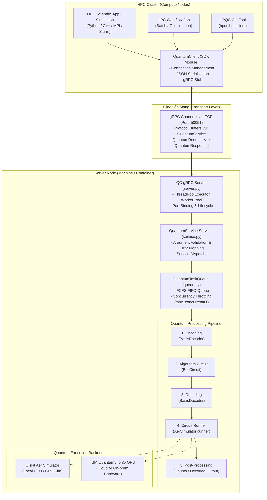
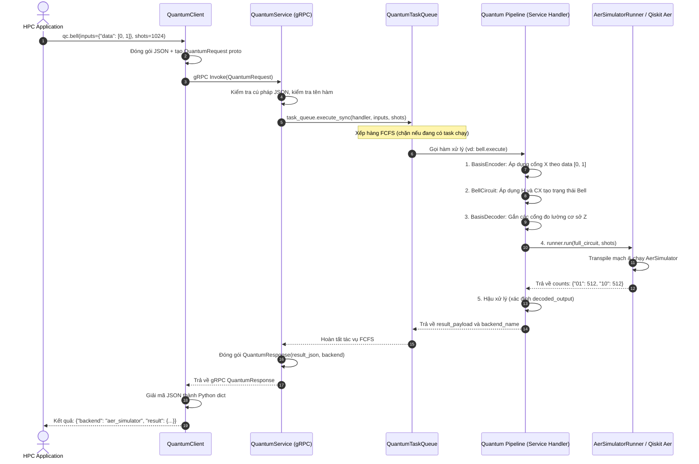

# HPC-QC Communication Stack (Quantum-HPC Integration Framework)

[](https://www.python.org/downloads/)
[](https://grpc.io/)
[](https://qiskit.org/)
[](https://github.com/Qiskit/qiskit-aer)
[](LICENSE)

Khung tích hợp hiệu năng cao kết nối các cụm tính toán cổ điển (**High-Performance Computing - HPC**) với các máy chủ lượng tử (**Quantum Computing - QC**). Hệ thống sử dụng giao thức **gRPC** (truyền tải trên nền HTTP/2 và nhị phân Protocol Buffers v3) giúp đạt độ trễ cực thấp, kiểm soát định kiểu dữ liệu chặt chẽ và cung cấp hàng đợi tác vụ tập trung (**Task Queue**) bảo vệ tài nguyên phần cứng lượng tử/bộ giả lập.

---

## 📑 Mục lục

- [HPC-QC Communication Stack (Quantum-HPC Integration)](#hpc-qc-communication-stack-quantum-hpc-integration)
- [HPC-QC Communication Stack (Quantum-HPC Integration Framework)](#hpc-qc-communication-stack-quantum-hpc-integration-framework)
  - [🌟 Key Features](#-key-features)
  - [📑 Mục lục](#-mục-lục)
  - [🏗 Architecture Overview](#-architecture-overview)
  - [1. Tính năng nổi bật](#1-tính-năng-nổi-bật)
  - [🚀 Getting Started](#-getting-started)
  - [2. Sơ đồ kiến trúc hệ thống](#2-sơ-đồ-kiến-trúc-hệ-thống)
    - [1. Installation](#1-installation)
    - [2.1. Kiến trúc phân tán tổng thể (Distributed Architecture)](#21-kiến-trúc-phân-tán-tổng-thể-distributed-architecture)
    - [2.2. Vòng đời xử lý tác vụ lượng tử (Task Execution Lifecycle)](#22-vòng-đời-xử-lý-tác-vụ-lượng-tử-task-execution-lifecycle)
  - [3. Chi tiết các khối chức năng (Component Deep-Dive)](#3-chi-tiết-các-khối-chức-năng-component-deep-dive)
    - [3.1. Cấu trúc thư mục](#31-cấu-trúc-thư-mục)
    - [3.2. Trách nhiệm và vai trò từng khối](#32-trách-nhiệm-và-vai-trò-từng-khối)
  - [4. Hướng dẫn cài đặt \& Thiết lập (Setup \& Installation)](#4-hướng-dẫn-cài-đặt--thiết-lập-setup--installation)
    - [4.1. Cài đặt môi trường Python (Venv / Conda)](#41-cài-đặt-môi-trường-python-venv--conda)
      - [Cách 1: Sử dụng Python venv chuẩn](#cách-1-sử-dụng-python-venv-chuẩn)
      - [Cách 2: Sử dụng Conda](#cách-2-sử-dụng-conda)
    - [2. Start the Quantum Server (QC Node)](#2-start-the-quantum-server-qc-node)
    - [4.2. Triển khai bằng Docker (Dành cho QC Server)](#42-triển-khai-bằng-docker-dành-cho-qc-server)
    - [4.3. Thiết lập môi trường phát triển (Development Setup)](#43-thiết-lập-môi-trường-phát-triển-development-setup)
    - [4.4. Cấu hình mạng giữa hai máy vật lý (Multi-Node Setup)](#44-cấu-hình-mạng-giữa-hai-máy-vật-lý-multi-node-setup)
  - [5. Kịch bản Demo \& Kiểm thử cụ thể (Hands-on Demos \& Testing)](#5-kịch-bản-demo--kiểm-thử-cụ-thể-hands-on-demos--testing)
    - [3. Run the HPC Client (HPC Node)](#3-run-the-hpc-client-hpc-node)
    - [Demo 1: Kiểm tra nhanh qua giao diện CLI](#demo-1-kiểm-tra-nhanh-qua-giao-diện-cli)
      - [Option A: Running the Example Script](#option-a-running-the-example-script)
      - [Option B: Using Python directly in your application](#option-b-using-python-directly-in-your-application)
  - [You can easily integrate quantum calls into your existing HPC pipelines:](#you-can-easily-integrate-quantum-calls-into-your-existing-hpc-pipelines)
    - [Demo 2: Chạy script mẫu tích hợp (`run_hpc_example.py`)](#demo-2-chạy-script-mẫu-tích-hợp-run_hpc_examplepy)
    - [Demo 3: Nhúng Client vào ứng dụng Python HPC](#demo-3-nhúng-client-vào-ứng-dụng-python-hpc)
      - [Option C: Using the Command Line Interface (CLI)](#option-c-using-the-command-line-interface-cli)
    - [Demo 4: Kiểm thử chịu tải \& Hàng đợi FCFS đa luồng](#demo-4-kiểm-thử-chịu-tải--hàng-đợi-fcfs-đa-luồng)
  - [🐳 Docker Deployment (Optional)](#-docker-deployment-optional)
    - [Demo 5: Chạy bộ kiểm thử tự động (Unit Tests với Pytest)](#demo-5-chạy-bộ-kiểm-thử-tự-động-unit-tests-với-pytest)
  - [6. Hướng dẫn mở rộng thuật toán mới](#6-hướng-dẫn-mở-rộng-thuật-toán-mới)
    - [Bước 1: Xây dựng mạch lượng tử](#bước-1-xây-dựng-mạch-lượng-tử)
    - [Bước 2: Tạo Service Handler](#bước-2-tạo-service-handler)
    - [Bước 3: Đăng ký Handler vào Registry](#bước-3-đăng-ký-handler-vào-registry)
    - [Bước 4: Gọi từ HPC Client](#bước-4-gọi-từ-hpc-client)
  - [7. Xử lý sự cố thường gặp (Troubleshooting)](#7-xử-lý-sự-cố-thường-gặp-troubleshooting)
  - [📄 License](#-license)

---

## 1. Tính năng nổi bật

*   **Truyền thông gRPC hiệu năng cao**: Tối ưu hóa cho môi trường HPC nhờ multiplexing trên HTTP/2, payload nhị phân gọn nhẹ và serialization nhanh bằng Google Protocol Buffers.
*   **Hàng đợi tác vụ FCFS (First-Come-First-Served)**: Kiểm soát mức độ đồng thời (`max_concurrent`), bảo vệ QPU thật hoặc bộ nhớ RAM của Qiskit Aer Simulator khỏi quá tải khi hàng loạt nút tính toán HPC gửi yêu cầu cùng lúc.
*   **Pipeline lượng tử module hóa**: Tách bạch hoàn toàn giữa 5 công đoạn: **Mã hóa (Encoding)** $\to$ **Thuật toán mạch (Circuits)** $\to$ **Giải mã/Đo lường (Decoding)** $\to$ **Bộ thực thi (Runners)** $\to$ **Hậu xử lý cổ điển (Post-Processing)**.
*   **Hỗ trợ Basis Encoding tự động**: Cho phép ứng dụng cổ điển HPC truyền vector bit nhị phân để tự động chuẩn bị trạng thái ban đầu của qubit bằng các cổng $X$ (NOT).
*   **Đa dạng giao diện tương tác**: Tích hợp trực tiếp qua Python SDK hoặc gọi qua Command Line Interface (CLI) thích hợp cho các Job Scripts của Slurm/PBS/MPI.
*   **Sẵn sàng đóng gói Docker**: QC Server có thể đóng gói thành container độc lập, dễ dàng deploy lên máy chủ hoặc Kubernetes.

---

## 2. Sơ đồ kiến trúc hệ thống

### 2.1. Kiến trúc phân tán tổng thể (Distributed Architecture)



---

### 2.2. Vòng đời xử lý tác vụ lượng tử (Task Execution Lifecycle)

Quy trình tuần tự từ lúc HPC Node phát lệnh tới khi nhận lại kết quả:



---

## 3. Chi tiết các khối chức năng (Component Deep-Dive)

### 3.1. Cấu trúc thư mục

```text
software_stack_hpcqc/
├── Dockerfile                      # Dockerfile triển khai độc lập QC Server
├── README.md                       # Tài liệu hướng dẫn chi tiết
├── requirements.txt                # Dependencies cho môi trường chạy (Runtime)
├── requirements-dev.txt            # Dependencies cho phát triển & testing (Protoc, Pytest)
├── pytest.ini                      # Cấu hình kiểm thử tự động
├── run_hpc_example.py              # Script mẫu chạy thử nghiệm từ HPC Client
├── run_concurrent_test.py          # Script kiểm thử đa luồng hàng đợi FCFS
│
├── hpqc/                           # Gói mã nguồn chính của framework
│   ├── communication/              # Tầng giao thức & chuẩn hóa truyền thông
│   │   └── v1/
│   │       ├── quantum.proto       # Định nghĩa Service & Message qua Protobuf
│   │       ├── quantum_pb2.py      # Python classes sinh ra từ Protobuf
│   │       ├── quantum_pb2_grpc.py # gRPC Client/Server stubs
│   │       └── generate_proto.sh   # Bash script biên dịch tự động file .proto
│   │
│   ├── hpc/                        # Tầng Client dành cho phía HPC
│   │   └── client.py               # Lớp QuantumClient và giao diện dòng lệnh CLI
│   │
│   └── qc/                         # Tầng Server & Thực thi Lượng tử
│       ├── server.py               # Khởi tạo gRPC Socket Server & quản lý tiến trình
│       ├── service.py              # Xử lý RPC Invoke, kiểm lỗi và định tuyến
│       ├── queue.py                # Hàng đợi FCFS (QuantumTaskQueue)
│       │
│       ├── encoding/               # Khối mã hóa dữ liệu cổ điển -> lượng tử
│       │   ├── base.py             # Abstract Base Class: BaseEncoder
│       │   └── basis_encoder.py    # Mã hóa cơ sở (Basis Encoding dùng cổng X)
│       │
│       ├── circuits/               # Khối định nghĩa các mạch thuật toán lượng tử
│       │   ├── base.py             # Abstract Base Class: BaseCircuit
│       │   └── bell_circuit.py     # Mạch sinh cặp trạng thái Bell (H + CNOT)
│       │
│       ├── decoding/               # Khối giải mã & đo lường trạng thái lượng tử
│       │   ├── base.py             # Abstract Base Class: BaseDecoder
│       │   └── basis_decoder.py    # Đo lường cơ sở tính toán
│       │
│       ├── runners/                # Khối điều khiển backend lượng tử
│       │   ├── base.py             # Abstract Base Class: BaseRunner
│       │   └── qiskit_runner.py    # Runner thực thi qua Qiskit AerSimulator
│       │
│       └── services/               # Registry và Điều phối Pipeline
│           ├── __init__.py         # FUNCTION_HANDLERS map tên hàm -> hàm thực thi
│           └── bell.py             # Ghép nối Pipeline cho hàm "bell"
│
└── tests/                          # Bộ Unit Tests & Integration Tests
    ├── test_client.py              # Kiểm thử QuantumClient và context manager (with)
    ├── test_components.py          # Kiểm thử Encoder, Circuit, Decoder, Runner
    ├── test_queue.py               # Kiểm thử tính tuần tự FIFO và cấu hình concurrency
    └── test_grpc_service.py        # Kiểm thử Servicer và xử lý mã lỗi gRPC
```

---

### 3.2. Trách nhiệm và vai trò từng khối

| Khối chức năng | Tệp tin / Module | Trách nhiệm chính |
| :--- | :--- | :--- |
| **Giao thức (Protocol)** | `hpqc/communication/v1/quantum.proto` | Định nghĩa schema chuẩn cho RPC `Invoke`: đầu vào nhận `function_name`, `input_json`, `shots`; đầu ra trả về `result_json`, `backend`. Đảm bảo tính tương thích phiên bản. |
| **HPC Client** | `hpqc/hpc/client.py` | Cung cấp interface Python (`QuantumClient`) cho các nhà khoa học dữ liệu HPC; hỗ trợ `with` context manager, tự động serialize JSON, quản lý kết nối TCP channel, hỗ trợ CLI tiện ích. |
| **QC Server Host** | `hpqc/qc/server.py` | Tạo socket server gRPC, thiết lập `ThreadPoolExecutor` nhận các kết nối mạng đồng thời, cấu hình `--max-workers`, hỗ trợ graceful shutdown (SIGINT/Ctrl+C). |
| **QC Service Dispatcher** | `hpqc/qc/service.py` | Kiểm tra tính hợp lệ của JSON đầu vào, bắt các ngoại lệ và trả về mã lỗi gRPC chuẩn (`INVALID_ARGUMENT`, `NOT_FOUND`, `INTERNAL`). |
| **Task Queue** | `hpqc/qc/queue.py` | Quản lý hàng đợi FCFS (First-Come-First-Served), cấu hình mức đồng thời qua biến môi trường `HPQC_MAX_CONCURRENT` (mặc định=1). Bảo vệ tài nguyên QPU lượng tử. |
| **Encoding Block** | `hpqc/qc/encoding/basis_encoder.py` | Nhận mảng dữ liệu nhị phân $[b_0, b_1, \dots]$ từ HPC, thêm các cổng Pauli-X vào các qubit tương ứng để chuẩn bị trạng thái lượng tử $|b_0 b_1 \dots\rangle$. |
| **Algorithm Circuit** | `hpqc/qc/circuits/bell_circuit.py` | Định nghĩa các cổng logic lượng tử cốt lõi của thuật toán (ví dụ: cổng Hadamard trên Qubit 0 và CNOT giữa Qubit 0 và Qubit 1). |
| **Decoding Block** | `hpqc/qc/decoding/basis_decoder.py` | Tạo mạch đo lường cơ sở tính toán (computational basis Z) tương ứng với số lượng qubit để trích xuất bit cổ điển. |
| **Backend Runner** | `hpqc/qc/runners/qiskit_runner.py` | Tái sử dụng engine `AerSimulator`, transpile mạch lượng tử tối ưu hóa cho backend, hỗ trợ gán seed ngẫu nhiên có thể tái lập kết quả. |
| **Service Pipeline** | `hpqc/qc/services/bell.py` | Tích hợp liên hoàn: `Encode` + `Algorithm` + `Decode` $\to$ Chạy qua `Runner` $\to$ Trích xuất kết quả `counts` và chuỗi bit chiếm xác suất cao nhất. |

---

## 4. Hướng dẫn cài đặt & Thiết lập (Setup & Installation)

### 4.1. Cài đặt môi trường Python (Venv / Conda)

Yêu cầu: Python >= 3.10 (khuyến nghị Python 3.11 hoặc 3.12).

#### Cách 1: Sử dụng Python venv chuẩn
```bash
# 1. Clone repository
git clone https://github.com/MagePro310/software_stack_hpcqc.git
cd software_stack_hpcqc

# 2. Khởi tạo môi trường ảo
python3 -m venv .venv
source .venv/bin/activate    # Trên Windows: .venv\Scripts\activate

# 3. Cài đặt các thư viện cần thiết
pip install --upgrade pip
pip install -r requirements.txt
```

#### Cách 2: Sử dụng Conda
```bash
conda create -n hpqc_env python=3.11 -y
conda activate hpqc_env
pip install -r requirements.txt
```

---

### 4.2. Triển khai bằng Docker (Dành cho QC Server)

Nếu máy chủ QC là máy ảo biệt lập hoặc chạy trên cụm Kubernetes:

```bash
# 1. Build Docker image
docker build -t hpqc-qc-server:0.1 .

# 2. Khởi chạy container, expose port 50051 ra ngoài host
docker run -d --name qc-server -p 50051:50051 hpqc-qc-server:0.1

# 3. Kiểm tra logs đảm bảo server đã sẵn sàng
docker logs -f qc-server
```

Khi muốn dừng server:
```bash
docker stop qc-server && docker rm qc-server
```

---

### 4.3. Thiết lập môi trường phát triển (Development Setup)

Nếu bạn muốn chỉnh sửa file protocol buffer `.proto` hoặc chạy các bài kiểm thử:

```bash
# Cài đặt thêm các công cụ dev (grpcio-tools, pytest)
pip install -r requirements-dev.txt

# Khi chỉnh sửa file hpqc/communication/v1/quantum.proto, hãy biên dịch lại:
bash hpqc/communication/v1/generate_proto.sh
```

---

### 4.4. Cấu hình mạng giữa hai máy vật lý (Multi-Node Setup)

Trong môi trường thực tế, HPC Client và QC Server thường nằm trên 2 máy tính khác nhau:

```text
[ Máy tính HPC Node ]                            [ Máy chủ QC Node ]
IP: 192.168.1.100                                IP: 192.168.1.200
Chạy script client Python                         Chạy server.py lắng nghe 0.0.0.0:50051
```

1. **Trên máy chủ QC (192.168.1.200)**:
   - Đảm bảo mở tường lửa cho cổng 50051:
     ```bash
     sudo ufw allow 50051/tcp
     ```
   - Khởi động server:
     ```bash
     python -m hpqc.qc.server --host 0.0.0.0 --port 50051
     ```

2. **Trên máy tính HPC (192.168.1.100)**:
   - Kiểm tra kết nối mạng:
     ```bash
     nc -zv 192.168.1.200 50051
     ```
   - Chỉ định IP máy QC khi gọi client:
     ```bash
     python -m hpqc.hpc.client --server 192.168.1.200:50051 --function bell
     ```

---

## 5. Kịch bản Demo & Kiểm thử cụ thể (Hands-on Demos & Testing)

Trước khi thực hiện các bài demo, mở một terminal và **khởi động QC Server**:

```bash
python -m hpqc.qc.server --host 0.0.0.0 --port 50051
```
*Dòng thông báo hiển thị:*
```text
INFO:hpqc.qc.queue:QuantumTaskQueue initialized with max_concurrent=1
QC server listening on 0.0.0.0:50051
```

---

### Demo 1: Kiểm tra nhanh qua giao diện CLI

Mở terminal thứ hai (đã kích hoạt virtualenv) và thực thi lệnh:

```bash
python -m hpqc.hpc.client \
  --server localhost:50051 \
  --function bell \
  --shots 1024
```

**Kết quả trả về:**
```json
{
  "backend": "aer_simulator",
  "result": {
    "counts": {
      "00": 519,
      "11": 505
    },
    "input": {},
    "decoded_output": "00"
  }
}
```
*Giải thích*: Do không truyền input data, trạng thái ban đầu của mạch là $|00\rangle$. Sau khi qua cổng $H(0)$ và $CX(0, 1)$, mạch tạo thành trạng thái vướng víu Bell $|\Phi^+\rangle = \frac{|00\rangle + |11\rangle}{\sqrt{2}}$. Kết quả đo lường 1024 lần cho ra tỉ lệ phân bố xấp xỉ 50% cho `00` và 50% cho `11`.

---

### Demo 2: Chạy script mẫu tích hợp (`run_hpc_example.py`)

Dự án cung cấp sẵn script `run_hpc_example.py` minh họa cả hai trường hợp: không có data và có data encoding:

```bash
python run_hpc_example.py --server localhost:50051 --shots 10000
```

**Kết quả hiển thị:**
```text
Đang kết nối tới QC Server tại localhost:50051...

--- Ví dụ 1: Bell Circuit cơ bản (|Phi+> state) ---
Thời gian thực thi: 0.0152s
Backend thực thi: aer_simulator
Kết quả (Counts): {'00': 4978, '11': 5022}
Trạng thái đo phổ biến nhất (Decoded): 11

--- Ví dụ 2: Bell Circuit kèm Encoding Data [0, 1] (|Psi+> state) ---
Thời gian thực thi: 0.0139s
Backend thực thi: aer_simulator
Kết quả (Counts): {'01': 5031, '10': 4969}
Trạng thái đo phổ biến nhất (Decoded): 01

Đã đóng kết nối gRPC.
```
*Ý nghĩa vật lý*: Khi truyền `data: [0, 1]`, `BasisEncoder` sẽ áp dụng cổng $X$ lên Qubit 1, biến đổi trạng thái thành $|10\rangle_{q_1 q_0}$. Khi đi qua khối Bell Circuit, trạng thái vướng víu biến đổi thành $|\Psi^+\rangle = \frac{|01\rangle + |10\rangle}{\sqrt{2}}$, do đó các trạng thái đo được chuyển hoàn toàn sang `01` và `10`.

---

### Demo 3: Nhúng Client vào ứng dụng Python HPC

Bạn có thể dễ dàng nhúng lệnh gọi lượng tử vào bất kỳ tác vụ mô phỏng hoặc tính toán cổ điển nào trên HPC:

```python
import numpy as np
from hpqc.hpc.client import QuantumClient

# Cách 1: Sử dụng context manager (khuyến nghị trong Python)
with QuantumClient("localhost:50051") as client:
    # Chuẩn bị dữ liệu cổ điển từ mô phỏng HPC
    classical_vector = [1, 1]
    
    # Gửi tác vụ lượng tử
    response = client.invoke(
        function_name="bell",
        inputs={"data": classical_vector},
        shots=4096
    )
    
    backend = response["backend"]
    counts = response["result"]["counts"]
    top_state = response["result"]["decoded_output"]
    
    print(f"Backend: {backend}")
    print(f"Đo lường: {counts}")
    print(f"Trạng thái xác suất lớn nhất: {top_state}")

# Hoặc Cách 2: Khởi tạo và close thủ công
# client = QuantumClient("localhost:50051")
# try:
#     response = client.bell(shots=1024)
# finally:
#     client.close()
```

---

### Demo 4: Kiểm thử chịu tải & Hàng đợi FCFS đa luồng

Để chứng minh **hàng đợi FCFS (`QuantumTaskQueue`)** hoạt động chính xác và an toàn khi nhiều tiến trình HPC cùng gửi task đồng thời:

```bash
python run_concurrent_test.py --server localhost:50051
```

**Kết quả quan sát được:**
```text
=== Bắt đầu Demo kiểm thử đồng thời tới QC Server (localhost:50051) ===
[Client 1] Gửi task với input=[0, 0], shots=2000...
[Client 2] Gửi task với input=[0, 1], shots=2000...
[Client 3] Gửi task với input=[1, 0], shots=2000...
[Client 4] Gửi task với input=[1, 1], shots=2000...
[Client 1] Hoàn thành sau 0.021s | Backend: aer_simulator | Decoded: 00 | Counts: {'00': 1012, '11': 988}
[Client 2] Hoàn thành sau 0.028s | Backend: aer_simulator | Decoded: 01 | Counts: {'01': 1004, '10': 996}
[Client 3] Hoàn thành sau 0.035s | Backend: aer_simulator | Decoded: 11 | Counts: {'11': 1015, '00': 985}
[Client 4] Hoàn thành sau 0.042s | Backend: aer_simulator | Decoded: 10 | Counts: {'01': 991, '10': 1009}

=== Tất cả 4 tasks đã hoàn thành trong 0.043s ===
```
*Nhận xét*: Cả 4 client đều gửi request gần như cùng một thời điểm. QC Server đưa các task vào hàng đợi FIFO và tuần tự thực thi trên mô phỏng mà không hề xảy ra xung đột hay suy hao tài nguyên.

---

### Demo 5: Chạy bộ kiểm thử tự động (Unit Tests với Pytest)

Dự án đi kèm bộ test tự động kiểm thử toàn diện các module:

```bash
# Cài đặt pytest nếu chưa có
pip install pytest pytest-mock

# Chạy toàn bộ test suite
pytest -v
```

**Kết quả kiểm thử:**
```text
============================= test session starts ==============================
rootdir: /path/to/software_stack_hpcqc
configfile: pytest.ini
testpaths: tests
collected 14 items

tests/test_client.py::test_client_context_manager PASSED                 [  7%]
tests/test_client.py::test_client_invoke PASSED                          [ 14%]
tests/test_components.py::test_basis_encoder PASSED                      [ 21%]
tests/test_components.py::test_bell_circuit PASSED                       [ 28%]
tests/test_components.py::test_basis_decoder PASSED                      [ 35%]
tests/test_components.py::test_aer_runner PASSED                         [ 42%]
tests/test_components.py::test_bell_service_execution_standard PASSED    [ 50%]
tests/test_components.py::test_bell_service_execution_encoded PASSED     [ 57%]
tests/test_grpc_service.py::test_service_invoke_bell PASSED               [ 64%]
tests/test_grpc_service.py::test_service_invalid_json PASSED              [ 71%]
tests/test_grpc_service.py::test_service_unknown_function PASSED          [ 78%]
tests/test_queue.py::test_queue_execution PASSED                          [ 85%]
tests/test_queue.py::test_queue_order PASSED                              [ 92%]
tests/test_queue.py::test_queue_env_concurrency PASSED                   [100%]

============================= 14 passed in 1.05s ===============================
```

---

## 6. Hướng dẫn mở rộng thuật toán mới

Để tích hợp một thuật toán lượng tử mới (ví dụ: tạo trạng thái 3-qubit **GHZ State**):

### Bước 1: Xây dựng mạch lượng tử
Tạo tệp `hpqc/qc/circuits/ghz_circuit.py`:
```python
from qiskit import QuantumCircuit
from .base import BaseCircuit

class GHZCircuit(BaseCircuit):
    def build(self) -> QuantumCircuit:
        circuit = QuantumCircuit(3)
        circuit.h(0)
        circuit.cx(0, 1)
        circuit.cx(1, 2)
        return circuit
```

### Bước 2: Tạo Service Handler
Tạo tệp `hpqc/qc/services/ghz.py`:
```python
from hpqc.qc.circuits.ghz_circuit import GHZCircuit
from hpqc.qc.runners.qiskit_runner import AerSimulatorRunner

def execute(inputs: dict, shots: int):
    circuit = GHZCircuit().build()
    circuit.measure_all()
    
    runner = AerSimulatorRunner()
    counts, backend = runner.run(circuit, shots)
    
    return {
        "counts": counts,
        "decoded_output": max(counts, key=counts.get)
    }, backend
```

### Bước 3: Đăng ký Handler vào Registry
Chỉnh sửa `hpqc/qc/services/__init__.py`:
```python
from hpqc.qc.services import bell, ghz

FUNCTION_HANDLERS = {
    "bell": bell.execute,
    "ghz": ghz.execute,  # <-- Đăng ký hàm mới tại đây
}
```

### Bước 4: Gọi từ HPC Client
```python
res = client.invoke(function_name="ghz", shots=1024)
print(res["result"]["counts"])  # Sẽ trả về {"000": ~512, "111": ~512}
```

---

## 7. Xử lý sự cố thường gặp (Troubleshooting)

| Mã lỗi / Hiện tượng | Nguyên nhân có thể | Cách khắc phục |
| :--- | :--- | :--- |
| `StatusCode.UNAVAILABLE: failed to connect to all addresses` | QC Server chưa được bật, hoặc tường lửa chặn cổng 50051. | 1. Kiểm tra QC Server đã chạy chưa (`python -m hpqc.qc.server`).<br>2. Kiểm tra IP và port (`nc -zv <IP> 50051`).<br>3. Mở cổng tường lửa: `sudo ufw allow 50051/tcp`. |
| `StatusCode.NOT_FOUND: unknown quantum function: xxx` | Hàm lượng tử `xxx` chưa được đăng ký trong server. | Kiểm tra tham số `function_name` gửi từ client hoặc đăng ký hàm vào `hpqc/qc/services/__init__.py`. |
| `StatusCode.INVALID_ARGUMENT: invalid input_json` | Tham số `inputs` gửi qua gRPC không thể serialize hoặc deserialize thành JSON hợp lệ. | Đảm bảo `inputs` là một Python `dict` chuẩn và các phần tử bên trong có thể mã hóa JSON. |
| `ModuleNotFoundError: No module named 'qiskit'` | Thiếu thư viện lượng tử hoặc chưa kích hoạt đúng môi trường ảo. | Chạy `source .venv/bin/activate` và kiểm tra `pip list` đã có `qiskit`, `qiskit-aer` hay chưa. |

---

## 📄 License
Phát hành theo giấy phép [MIT License](LICENSE).
